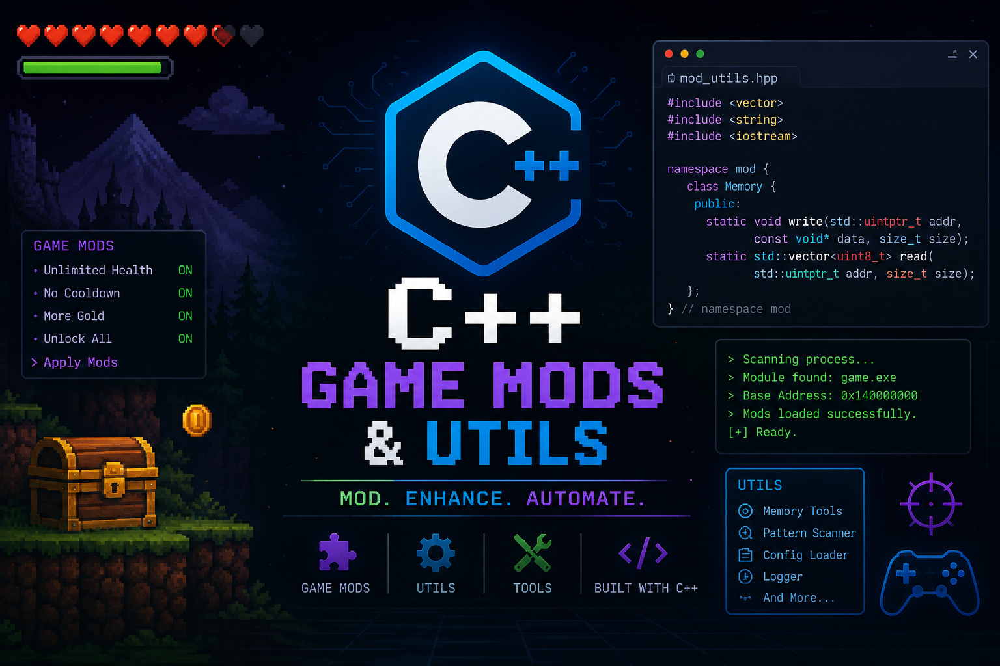

# helobro2



A collection of **C++ utilities and experimental projects**. This repository contains various standalone programs and utilities, from games to system utilities.

---

## 📦 Projects

### 🎮 Snake Game (`snake_game.cpp`)
A classic console-based Snake game implementation in C++.

**Features:**
- Playable Snake game in the console
- Score tracking
- Collision detection (walls and self)
- Smooth game mechanics

**Controls:**
- `W` - Move Up
- `S` - Move Down
- `A` - Move Left
- `D` - Move Right
- `ESC` - Quit

**Compile & Run:**
```bash
g++ -o snake_game snake_game.cpp
./snake_game
```

---

### 🚀 Startup Launcher (`startup_launcher.cpp`)
A Windows utility that automatically launches applications on startup.

**Features:**
- Launches Discord and Chrome automatically
- Checks multiple installation paths
- Windows-based (uses Windows API)
- Extensible for adding more applications

**Compile & Run:**
```bash
g++ -o startup_launcher startup_launcher.cpp
./startup_launcher
```

---

## 📋 Requirements

- C++11 or later
- Windows OS (for Windows-specific utilities)

---

## 📝 Notes

- Some projects are Windows-specific (Snake Game, Startup Launcher)
- All projects are experimental and stupid 💀

---

## 🤝 Contributing

Found a bug or have improvements? Feel free to open an issue or submit a pull request! (I want the pull request badge lol).

---

## 📄 License

APACHE LICENSE V2
Read more about Apache licence V2 online

---
